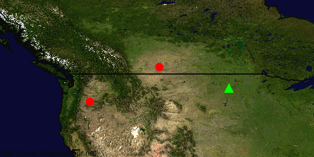

simple-mappr
============

[![Gem Version][1]][2]
[![Continuous Integration Status][3]][4]
[![Dependency Status][10]][11]

Ruby Gem wrapper for the SimpleMappr API
----------------------------------------

Use simple-mappr to send structured, geographic data to
the [SimpleMappr][9] API and receive either:

* a hash containing a URL to the map image and its expiry date, or
* a file to be downloaded

Download and Installation
-------------------------

The latest version of SimpleMappr can be installed with RubyGems:

```
$ gem install simple-mappr
```

Source code can be downloaded on [GitHub][5]. See the public methods to learn all the setter.

Example 1
---------

```ruby
require 'simple-mappr'
sm = SimpleMappr.new
sm.points = ['45,-120\n50,-110','47,-100']
sm.color = ['255,0,0','0,255,0']
sm.size = [12,14]
sm.shape = ['circle','triangle']
sm.layers = 'blueMarble'
sm.zoom = 4
sm.width = 450
sm.create
```

Returns a Hash:

```ruby
{:imageURL=>"http://img.simplemappr.net/5792da8e_24f7_0.png", :expiry=>"2016-07-23T04:46:39-04:00"}
```

Corresponding to the image:



Example 2
---------

```ruby
require 'simple-mappr'
sm = SimpleMappr.new
sm.points = ['45,-120\n50,-110','47,-100']
sm.output = 'svg'
sm.download("/tmp/my-map") # file title without extension
```

Downloads the image to /tmp/my-map.svg

License
-------

SimpleMappr is released under the [MIT license][6].

Support
-------

Bug reports can be filed at [https://github.com/dshorthouse/simple-mappr/issues][7].

Copyright
---------

Authors: [David P. Shorthouse][8]

Copyright (c) 2016 David P. Shorthouse

[1]: https://badge.fury.io/rb/simple-mappr.svg
[2]: http://badge.fury.io/rb/simple-mappr
[3]: https://secure.travis-ci.org/dshorthouse/simple-mappr.svg
[4]: http://travis-ci.org/dshorthouse/simple-mappr
[5]: https://github.com/dshorthouse/simple-mappr
[6]: http://www.opensource.org/licenses/MIT
[7]: https://github.com/dshorthouse/simple-mappr/issues
[8]: https://github.com/dshorthouse
[9]: http://www.simplemppr.net
[10]: https://gemnasium.com/dshorthouse/simple-mappr.svg
[11]: https://gemnasium.com/dshorthouse/name-spotter